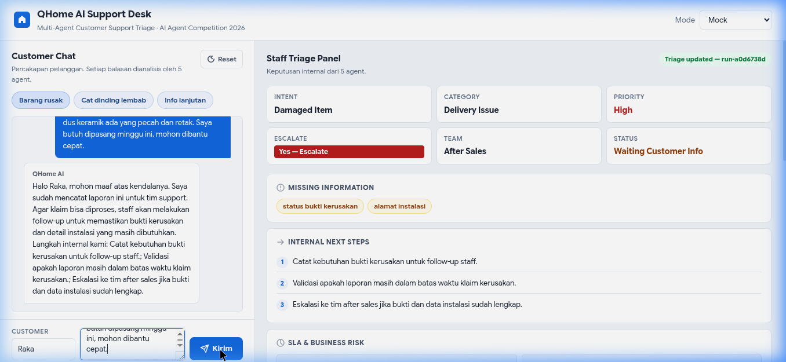
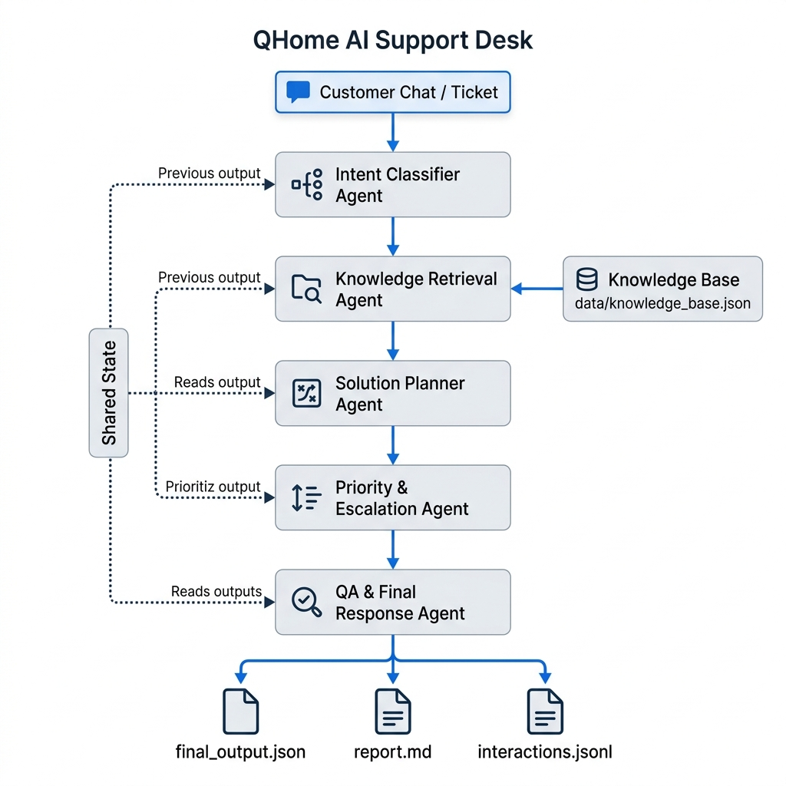

<div align="center">
  <h1>🏠 QHome AI Agent</h1>
  <p><strong>Sistem Multi-Agent Orchestrator untuk Triage Customer Support & Quotation Material Bangunan</strong></p>
  <p><em>Submission untuk <b>AI Agent Competition 2026</b> — Mewakili QHome Mart Yogyakarta</em></p>

  [](https://python.org)
  [](https://sqlite.org)
  [](#-pengujian--evaluasi)
  [](#-pengujian--evaluasi)
  [](LICENSE)
</div>

<br>

**QHome AI Agent** adalah solusi asisten cerdas berbasis *Multi-Agent AI* yang berjalan secara otonom. Berbeda dari *chatbot* biasa, sistem ini bertindak seperti kumpulan spesialis: ada agen yang khusus mengklasifikasikan tiket, ada yang mencari produk dari database, ada yang berdebat (*Critic Debate Loop*) tentang harga, dan ada yang menghitung kuantitas bahan bangunan.

---

## 📸 Web UI & Staff Dashboard

Kami telah merancang antarmuka visual (Web UI) yang fungsional bagi dua sisi:
- **Customer UI**: Tampilan bersih untuk chat interaktif pelanggan.
- **Staff Dashboard**: Panel admin (*Live Trace*) yang menampilkan eksekusi *agent* secara *real-time* per tiket.



---

## 📐 Arsitektur Sistem Utama

Sistem ini didesain menggunakan **Hybrid Orchestration** dengan **Triage Router Agent** bertindak sebagai gerbang terdepan.



### 🚀 Business Rules Terintegrasi
1. **Complaint-First Priority**: Jika pelanggan mengeluh dan ingin membeli di pesan yang sama, sistem **WAJIB** menyelesaikan keluhan (mengirim ke *Support Pipeline*) dan menunda nada *sales* agresif demi perlindungan reputasi (*Tone Protection*).
2. **Dynamic Pipeline Switching**: Jika pelanggan sudah selesai dengan urusan *support* dan **pesan terbarunya** murni tentang pemesanan bahan, sistem akan menyeberang (*switch*) otomatis ke *Renovation Pipeline*.
3. **Anti-Looping**: Klasifikasi AI berfokus pada **pesan terbaru** pelanggan, sehingga AI tidak akan terjebak merangkum keluhan lama yang sudah diselesaikan.

---

## 🗂️ Detail 2 Jalur Pipeline

Sistem akan menyeleksi 1 dari 2 pipeline ini berdasarkan keputusan Triage Router:

### 🔧 5-Agent Support Pipeline
Diaktifkan untuk komplain, retur, pelacakan pengiriman, dan pertanyaan umum.
1. `intent_classifier`: Klasifikasi berbasis *latest message*.
2. `knowledge_retrieval`: Menarik kebijakan garansi / FAQ dari Knowledge Base.
3. `solution_planner`: Merancang resolusi perbaikan masalah.
4. `priority_escalation`: Audit eskalasi & SLA bisnis.
5. `qa_final_response`: Merumuskan respons empatik akhir.

### 🏗️ 7-Agent Renovation & Quotation Pipeline
Diaktifkan untuk konsultasi renovasi (misal: "kamar mandi 2x2") dan order baru.
1. `requirement_intake`: Ekstrak parameter m², budget, & tipe ruangan.
2. `product_retrieval`: SQL Query material ke database SQLite `products`.
3. `inventory_snapshot`: Validasi ketersediaan `inventory_snapshots`.
4. `quantity_estimator`: **Kalkulator Deterministik** (rumus liter cat & luas ubin + waste 10%).
5. `quote_builder`: Generate tiket `QTE-XXXX` & harga subtotal.
6. `risk_verifier`: *Critic loop* — Mencegah janji palsu tentang ketersediaan stok & garansi harga.
7. `staff_handoff_response`: Susun draf *Whatsapp* internal & balasan pelanggan.

---

## 💾 Persistensi Data (Zero Heavy Dependencies)

Sistem didesain *plug-and-play* untuk dewan juri. Kami sengaja menggunakan **SQLite** agar tidak perlu ada setup Docker/MariaDB eksternal. Namun, arsitektur ini sudah siap di-*scale* melalui **External Database Adapter**.

**Alur Data:**
`JSON Seed Files` ➜ `python run.py init-db` ➜ `data/qhome_agent.db`

**Struktur Tabel:**
- 🛒 `products` & `inventory_snapshots`: Katalog dan stok gudang.
- 💬 `tickets` & `messages`: Tiket operasional dan *chat history*.
- 📝 `quotes` & `quote_items`: Draf penawaran sistem.
- 🤖 `agent_runs` & `agent_steps`: Metadata dan *trace* log per-agen untuk observabilitas staf.
- 📜 `policies`: Guardrail internal perusahaan.

*(Lihat `docs/external_db_adapter.md` untuk konfigurasi koneksi ke DB MySQL/PostgreSQL).*

---

## 🛠️ Cara Menjalankan (Step-by-Step)

### 1. Inisialisasi Database
```bash
python3 run.py init-db
```
Ini akan membuat database SQLite dari nol. Sangat aman dieksekusi berulang kali (Idempotent).

### 2. Jalankan Live Web Server
```bash
python3 run.py web
```
Akses di browser Anda:
- **Pelanggan**: `http://127.0.0.1:8000/`
- **Dashboard Staf**: `http://127.0.0.1:8000/staff`

> *Sangat disarankan menggunakan API Key sungguhan untuk demo terbaik.*
> Buat file `.env`:
> ```ini
> AI_API_KEY=your_api_key_here
> AI_BASE_URL=https://ai.sumopod.com/v1
> AI_MODEL=gpt-4o-mini
> ```

---

## 🧪 Pengujian Ketat (Eval & Unit Tests)

Sistem ini bukanlah sekadar *prompt engineering*, melainkan aplikasi *production-grade* yang teruji mutunya.

**1. Unit Testing (100% Success)**
```bash
python3 -m unittest discover -s tests -v
```
Memvalidasi kalkulator deterministik, *pipeline switching*, SQLite persistence, dan penolakan injeksi prompt (adversarial tests). **(20/20 PASSED)**.

**2. Automated Evaluation Suite**
```bash
python3 run.py eval
```
Uji coba otonom terhadap 7 skenario kompleks (kamar mandi 2x2, cat dinding lembab, komplain barang pecah campur pesanan, bahasa slang, dll). 
**Skor Rata-Rata: 28.29 / 30.0 (7/7 Skenario LULUS)**.

---
*Dikembangkan oleh Jalu Er — AI Agent Competition 2026*
