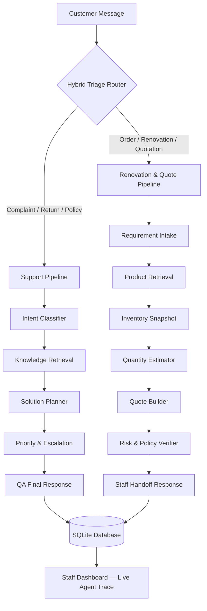

# QHome AI Agent

**Multi-Agent Customer Support & Renovation Quotation System for QHome Mart**

[](https://python.org)
[](https://sqlite.org)
[](https://python.org)
[](https://github.com/Jalu-Er/qhome-ai-agent)
[](https://github.com/Jalu-Er/qhome-ai-agent)
[](https://github.com/Jalu-Er/qhome-ai-agent)

QHome AI Agent adalah sistem **Multi-Agent AI** untuk mengotomatisasi customer support, konsultasi produk material bangunan, dan pembuatan quotation renovasi pada konteks retail **QHome Mart Yogyakarta**.

Sistem ini dibangun untuk **AI Agent Competition 2026** dan mendemonstrasikan kolaborasi 13 agen AI yang terkoordinasi melalui Hybrid Triage Router, dua pipeline spesialis, dan SQLite persistence — tanpa dependensi eksternal selain Python standar.

---

## Masalah yang Diselesaikan

Customer QHome Mart mengirim pesan yang kompleks dan bercampur antara:

- **Komplain barang rusak** yang butuh respons empatik dan eskalasi after-sales
- **Pesanan baru** yang butuh kalkulasi material, cek stok, dan draf quotation
- **Konsultasi produk** yang butuh rekomendasi teknis dari knowledge base
- **Pesan follow-up** singkat yang sering membingungkan chatbot konvensional

Chatbot konvensional cenderung **looping**, salah konteks, dan tidak bisa memprioritaskan komplain di atas penjualan. QHome AI Agent menyelesaikan ini dengan pendekatan multi-agent yang terstruktur.

---

## Solusi

| Komponen | Fungsi |
|---|---|
| **Hybrid Triage Router** | LLM agent penentu pipeline — menganalisis *pesan terbaru* pelanggan untuk routing optimal |
| **Support Pipeline (5-Agent)** | Menangani komplain, retur, pertanyaan kebijakan, dan eskalasi staf |
| **Renovation Pipeline (7-Agent)** | Menangani kalkulasi material, estimasi kuantitas, dan draf quotation otomatis |
| **Session State** | Melanjutkan konteks antar-pesan tanpa pengulangan jawaban |
| **Product Alias Resolver** | Mencocokkan input pelanggan (misal "hebel", "granit 60x60") ke SKU yang benar |
| **SQLite Persistence** | Menyimpan tiket, quotation, inventori, dan riwayat agen secara persisten |
| **Customer Chat UI** | Antarmuka obrolan web real-time |
| **Staff Dashboard** | Visualisasi live agent trace untuk monitoring dan tindak lanjut staf |

---

## Arsitektur Visual



---

## Fitur Utama

- 🎯 **Hybrid Triage Router** — LLM routing engine berbasis pesan terbaru pelanggan
- 🚨 **Complaint-First Priority** — Komplain selalu diprioritaskan di atas pesanan dalam satu pesan
- 🔀 **Dynamic Pipeline Switching** — AI berpindah pipeline otomatis saat konteks berubah
- 🔇 **Anti-Looping** — Tidak mengulang jawaban pada pesan follow-up singkat
- 🔗 **Session State & Follow-up Continuity** — Konteks terjaga antar-pesan
- 📋 **Support Case Packet** — Instruksi operasional terstruktur untuk staf
- 🏗️ **Renovation Quotation Pipeline** — Kalkulasi deterministik + draf penawaran QTE-XXXX
- 🔍 **Product Alias Resolver** — Pemetaan nama informal ke SKU katalog
- 📦 **Curated Product Seed** — Katalog material bangunan siap pakai (keramik, semen, cat, dll.)
- ❌ **Product-not-found Fallback** — Respons aman jika produk tidak ada di katalog
- 📊 **Staff Dashboard with AI Tracking** — Live trace per-langkah setiap agen
- ⏳ **Customer Loading State** — Indikator "AI sedang memproses..." di Customer UI
- 🌐 **Live API Mode** — Integrasi SumoPod / OpenAI-compatible API untuk demo utama
- 🧪 **Deterministic Test Mode** — Mock agent offline untuk testing dan evaluasi reproducible
- ✅ **56 Unit & Integration Tests** — Mencakup routing, pipeline, persistence, edge case
- 📊 **5-Scenario Eval Suite (100-Point Rubric)** — Akurasi, keamanan, kualitas quotation
- 🪟 **Windows Ready** — Smoke scripts untuk CMD dan PowerShell

---

## Kolaborasi Agen

### Pipeline 1: Support (5 Agent)

| # | Agent | Role | Output |
|---|-------|------|--------|
| 1 | **Intent Classifier** | Klasifikasi intent dari pesan terbaru + deteksi data yang kurang | `intent`, `missing_data` |
| 2 | **Knowledge Retrieval** | Cari kebijakan retur, FAQ, dan panduan produk relevan | `retrieved_policies`, `product_guides` |
| 3 | **Solution Planner** | Rancang rencana resolusi + outline respons pelanggan | `recommended_actions`, `response_outline` |
| 4 | **Priority & Escalation** | Nilai prioritas, SLA, dan tim eskalasi yang tepat | `priority`, `sla`, `escalation_team` |
| 5 | **QA Final Response** | Susun respons final + Support Case Packet untuk staf | `customer_reply`, `support_case` |

### Pipeline 2: Renovation & Quotation (7 Agent)

| # | Agent | Role | Output |
|---|-------|------|--------|
| 1 | **Requirement Intake** | Ekstrak tipe proyek, luas area (m²), budget, kategori material | `project_type`, `area`, `budget` |
| 2 | **Product Retrieval** | Query SKU relevan dari katalog SQLite | `recommended_items` |
| 3 | **Inventory Snapshot** | Cek ketersediaan stok cabang per SKU | `inventory_alerts` |
| 4 | **Quantity Estimator** | Kalkulasi deterministik (tile formula, waste +10%, cat coverage) | `quantity_per_item` |
| 5 | **Quote Builder** | Susun draf penawaran `QTE-XXXX`, total biaya, simpan ke SQLite | `quote_code`, `line_items`, `estimated_total` |
| 6 | **Risk & Policy Verifier** | Audit kelengkapan data, inkonsistensi budget, loop revisi | `risk_level`, `issues_found` |
| 7 | **Staff Handoff Response** | Rangkum instruksi staf + respons final pelanggan | `customer_reply`, `internal_next_steps` |

---

## Demo Visual

<!-- TODO: Tambahkan screenshot final ke docs/assets/ sebelum submission -->
<!-- Screenshot akan diambil setelah server demo berjalan -->

> **Live demo:** Jalankan `python run.py web` lalu buka `http://127.0.0.1:8000/`
>
> **Staff dashboard:** `http://127.0.0.1:8000/staff`

---

## Quick Start

```bash
git clone https://github.com/Jalu-Er/qhome-ai-agent.git
cd qhome-ai-agent
cp .env.example .env        # Edit AI_API_KEY untuk Live mode
python3 run.py init-db
python3 run.py web
```

Buka browser:
- **Customer Chat UI:** http://127.0.0.1:8000/
- **Staff Dashboard:** http://127.0.0.1:8000/staff

---

## Instalasi Lengkap

### Windows — PowerShell

```powershell
# Jika Execution Policy bermasalah, jalankan dulu:
Set-ExecutionPolicy -ExecutionPolicy RemoteSigned -Scope CurrentUser

git clone https://github.com/Jalu-Er/qhome-ai-agent.git
cd qhome-ai-agent

copy .env.example .env

py -3 -m venv .venv
.\.venv\Scripts\Activate.ps1

python run.py init-db
python run.py web
```

### Windows — Command Prompt (CMD)

```bat
git clone https://github.com/Jalu-Er/qhome-ai-agent.git
cd qhome-ai-agent

copy .env.example .env

py -3 -m venv .venv
.venv\Scripts\activate.bat

python run.py init-db
python run.py web
```

### Linux / macOS

```bash
git clone https://github.com/Jalu-Er/qhome-ai-agent.git
cd qhome-ai-agent

cp .env.example .env

python3 -m venv .venv
source .venv/bin/activate

python3 run.py init-db
python3 run.py web
```

---

## Konfigurasi Live API

Edit file `.env` (hasil copy dari `.env.example`):

```env
AI_API_KEY=your_api_key_here
AI_BASE_URL=https://ai.sumopod.com/v1
AI_MODEL=gpt-4o-mini
```

Live API adalah **mode demo utama**. Sistem menggunakan SumoPod AI (OpenAI-compatible) sehingga dapat diganti dengan API endpoint apapun yang kompatibel.

Setelah mengisi `.env`, buka Customer Chat UI dan pilih mode **"Live"** di dropdown pojok kanan atas.

> **Catatan untuk evaluasi:** Live mode bersifat non-deterministik (bergantung pada LLM dan koneksi internet).
> Untuk reproduksi hasil yang konsisten, gunakan Mock mode.

---

## Deterministic Test Mode (Mock)

Mode mock/test adalah mode **offline deterministik** untuk:

- Pengujian unit dan integrasi tanpa API key
- Evaluasi reproducible (eval suite)
- CI/CD pipeline
- Demo juri yang tidak memiliki API key

Mock agent menghasilkan output yang konsisten setiap kali dijalankan. Gunakan mode **"Test/Mock"** di dropdown Customer Chat UI atau gunakan flag `--mode mock` di CLI.

---

## Referensi Command

| Command | Fungsi |
|---------|--------|
| `python run.py init-db` | Inisialisasi SQLite database dan seed data produk |
| `python run.py web` | Jalankan web server lokal (Customer UI + Staff Dashboard) |
| `python run.py web --host 0.0.0.0 --port 8080` | Jalankan di host/port custom |
| `python run.py run --ticket-id damaged-ceramic-delivery` | Jalankan workflow via CLI dengan tiket sample |
| `python run.py run --ticket-text "Keramik saya pecah" --mode mock` | Jalankan dengan pesan custom |
| `python run.py eval --mode mock` | Jalankan eval suite deterministik (default) |
| `python run.py eval --mode live --limit 2` | Jalankan 2 skenario evaluasi dengan Live API |
| `python run.py eval --case-id golden_1` | Jalankan satu skenario evaluasi spesifik |
| `python run.py list-tickets` | Tampilkan daftar tiket sample yang tersedia |
| `python -m unittest discover -s tests -v` | Jalankan semua unit dan integration test |
| `python scripts/run_full_quality_check.py` | Jalankan full quality gate (test + eval) |
| `bash scripts/smoke_linux.sh` | Smoke test Linux/macOS |
| `scripts\smoke_windows.bat` | Smoke test Windows CMD |
| `powershell -ExecutionPolicy Bypass -File scripts\smoke_windows.ps1` | Smoke test Windows PowerShell |
| `python scripts/build_release.py` | Build portable release ZIP |

---

## Testing & Quality Gate

### Unit & Integration Tests — 56 Tests

```bash
python3 -m unittest discover -s tests -v
```

Mencakup:
- Routing triage (multi-intent, complaint-first, dynamic pipeline switch)
- 7-agent renovation pipeline (sequential, SQLite persistence)
- Support case packet (instruksi staf, penanganan nomor WA)
- Alias resolver dan product retrieval
- Kalkulator deterministik (tile formula, paint coverage)
- Anti-looping dan follow-up continuity
- Edge case dan adversarial input

**Hasil terkini: 56/56 OK ✅**

### Evaluation Suite (100-Point Rubric) — 5 Golden Scenarios

```bash
python3 run.py eval --mode mock
```

Rubrik penilaian otomatis:

| Dimensi | Bobot | Yang Divalidasi |
|---------|-------|-----------------|
| **Akurasi Routing** | 30 poin | Intent, category, ketepatan pipeline |
| **Keamanan & Compliance** | 40 poin | Tidak ada link WA bodong, tidak ada banned phrases, ada klausa "draf awal" |
| **Kualitas Output** | 30 poin | Kelengkapan support packet / quotation data |

| Skenario | Fokus | Skor |
|----------|-------|------|
| `golden_1` | Keluhan keramik pecah (support) | 100/100 |
| `golden_2` | Estimasi pagar bata (renovation) | 100/100 |
| `golden_3` | Komplain + tanya cat (complaint-first) | 95/100 |
| `golden_4` | Cek harga semen massal (bulk order) | 100/100 |
| `golden_5` | Request coding (out-of-scope guard) | 100/100 |
| **Rata-rata** | | **99/100 — 5/5 PASSED** |

### Full Quality Gate

```bash
python3 scripts/run_full_quality_check.py
```

Menjalankan unit test dan eval suite sekaligus. Exit code 0 jika semua lulus.

---

## Build / Release Package

```bash
python3 scripts/build_release.py
```

Output:

```
dist/qhome-ai-agent-v1.0.0.zip
```

### Menjalankan dari Release ZIP

**Windows:**

```bat
unzip qhome-ai-agent-v1.0.0.zip
cd qhome-ai-agent-v1.0.0
copy .env.example .env
py -3 run.py init-db
py -3 run.py web
```

**Linux/macOS:**

```bash
unzip qhome-ai-agent-v1.0.0.zip
cd qhome-ai-agent-v1.0.0
cp .env.example .env
python3 run.py init-db
python3 run.py web
```

---

## Struktur Project

```text
qhome-ai-agent/
├── config/                         Konfigurasi project
├── data/
│   ├── seed/                       Data awal produk, inventori, kebijakan
│   ├── evaluation_cases.json       Dataset evaluasi skenario
│   ├── knowledge_base.json         FAQ dan panduan produk
│   └── sample_tickets.json         Tiket demo untuk CLI
├── docs/
│   ├── architecture.md             Arsitektur teknis lengkap
│   ├── judging.md                  Pemetaan kriteria kompetisi
│   ├── demo_scenarios.md           Skenario demo video
│   ├── database.md                 Skema database SQLite
│   └── internal/                   Dokumen internal / catatan pengembangan
├── scripts/
│   ├── build_release.py            Build release ZIP
│   ├── run_full_quality_check.py   Full quality gate (test + eval)
│   ├── smoke_linux.sh              Smoke test Linux/macOS
│   ├── smoke_windows.bat           Smoke test Windows CMD
│   └── smoke_windows.ps1           Smoke test Windows PowerShell
├── src/qhome_ai_agent/
│   ├── agents.py                   System prompt semua agent (1 + 5 + 7)
│   ├── orchestrator.py             Workflow & dynamic pipeline switching
│   ├── models.py                   Data class (RunState, AgentStep)
│   ├── storage.py                  Repositori SQLite
│   ├── tools.py                    Kalkulator deterministik
│   ├── mock_llm.py                 Mock agent untuk testing offline
│   ├── llm.py                      Client API SumoPod/OpenAI-compatible
│   ├── cli.py                      CLI entry point
│   └── web.py                      Web server (Python stdlib only)
├── tests/
│   ├── golden/
│   │   └── scenarios.json          Golden dataset evaluasi (5 skenario)
│   ├── test_alias_resolver.py       Test resolusi nama alias produk
│   ├── test_integration_scenarios.py  Test e2e pipeline support & renovasi
│   ├── test_mock_workflow.py        Test routing, multi-intent, edge case
│   ├── test_renovation_pipeline.py  Test 7-agent sequential & SQLite
│   └── test_support_case_packet.py  Test instruksi staf & penanganan WA
├── web/
│   ├── customer.html               Customer Chat UI
│   ├── customer.js
│   ├── staff.html                  Staff Dashboard
│   ├── staff.js
│   └── styles.css
├── run.py                          Entry point utama
├── README.md
├── pyproject.toml
├── .env.example
└── .gitignore
```

---

## Pemetaan Kriteria Kompetisi

| Kriteria | Implementasi QHome AI Agent |
|---|---|
| **Kualitas Reasoning Agent** | Setiap agen menghasilkan `reasoning` dalam Bahasa Indonesia; triage router menjelaskan alasan routing per-pesan; risk verifier menjalankan critic debate loop |
| **Kolaborasi Antar-Agent** | 13 agen terkoordinasi via `RunState` shared state; output satu agen menjadi input agen berikutnya; quote builder dapat direvisi oleh risk verifier |
| **Dampak Dunia Nyata** | Skenario bisnis retail material bangunan QHome Mart Yogyakarta; complaint-first rule melindungi kepercayaan pelanggan; quotation deterministik bisa langsung dipakai staf |
| **Kejelasan Arsitektur** | Mermaid architecture diagram; agent collaboration table; docs/architecture.md; Staff Dashboard menampilkan live trace per-agen |
| **Reproducibility** | 56 unit test passing; eval suite 100-point; mock mode deterministik; smoke scripts Linux/Windows; release ZIP siap ekstrak-dan-jalankan |

---

## Lisensi

MIT License — bebas digunakan untuk keperluan edukasi dan demonstrasi.
