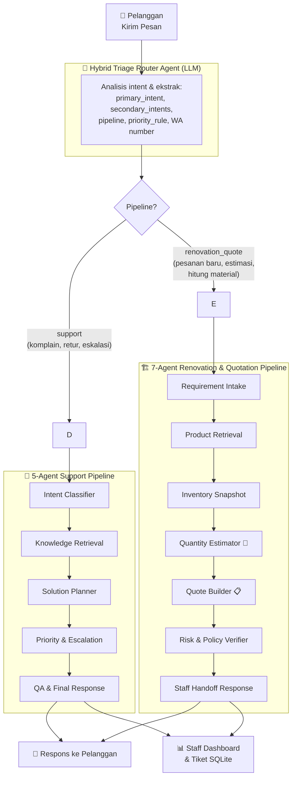
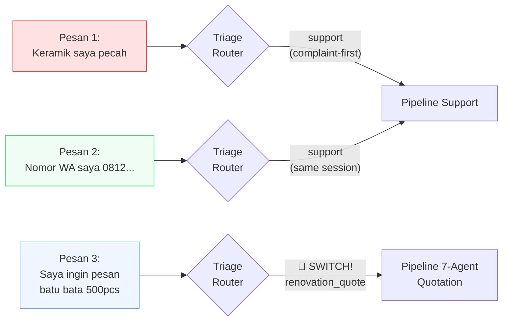
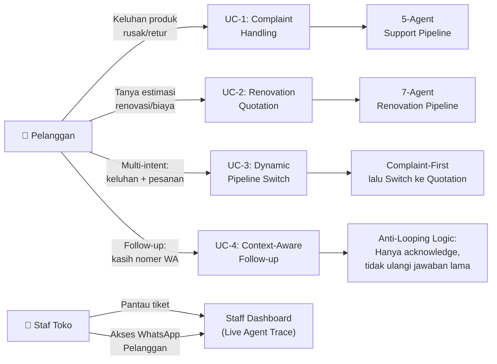

# QHome AI Agent 🏠

> **AI Agent Competition 2026** — Submission by QHome Mart Yogyakarta

**QHome AI Agent** adalah sistem **Multi-Agent Orchestrator** modern yang dirancang untuk mengotomatisasi triage customer support, konsultasi produk, kalkulasi material bangunan, dan pembuatan draf penawaran (quotation) secara end-to-end — untuk bisnis retail material bangunan **QHome Mart**.

[](https://python.org)
[](https://sqlite.org)
[](#-pengujian--evaluasi)
[](#-pengujian--evaluasi)
[](LICENSE)

---

## 📐 Arsitektur Sistem — High-Level Overview

Setiap pesan pelanggan melewati **Hybrid Triage Router** sebelum diarahkan ke salah satu dari dua pipeline agen.



### Aturan Bisnis Utama: Dynamic Pipeline Switching



---

## 🚀 Fitur Utama

| Fitur | Keterangan |
|-------|-----------|
| **🧭 Hybrid Triage Router** | Agen LLM pertama; mendeteksi `primary_intent`, `secondary_intents`, pipeline target, nomor WA, dan instruksi handoff staf dalam satu panggilan JSON. |
| **🔄 Dynamic Pipeline Switching** | Secara otomatis berpindah antara pipeline `support` dan `renovation_quote` berdasarkan **pesan terbaru** pelanggan, tanpa perlu intervensi staf. |
| **⚖️ Complaint-First Priority** | Jika komplain dan pesanan muncul di pesan yang **sama**, sistem selalu prioritaskan penanganan keluhan sebelum melayani pesanan baru. |
| **🏗️ 7-Agent Renovation Pipeline** | Kalkulasi deterministik (waste +10%), query SQLite SKU produk, cek stok real-time, dan pembuatan kode quotation unik `QTE-XXXX` secara otomatis. |
| **💾 SQLite Persistent Storage** | Semua tiket, kuotasi, riwayat agen, dan data produk tersimpan persisten di `data/qhome_agent.db`. |
| **📊 Live Staff Dashboard** | Tampilan real-time progress agen per tiket, highlight WA pelanggan, detail routing triage, dan tombol aksi staf. |
| **🧪 Eval Suite + Unit Tests** | 7 skenario evaluasi otomatis & 20 unit test CI/CD. |

---

## 🗂️ Struktur Pipeline Detail

### Pipeline 1: Support (5-Agent)
Diaktifkan untuk komplain, retur, pertanyaan kebijakan, dan eskalasi risiko.

```
triage_router → intent_classifier → knowledge_retrieval → solution_planner → priority_escalation → qa_final_response
```

| Agen | Fungsi |
|------|--------|
| `intent_classifier` | Klasifikasi intent berdasarkan **pesan terbaru** (bukan seluruh riwayat) |
| `knowledge_retrieval` | Cari FAQ, kebijakan retur, dan panduan produk yang relevan dari KB |
| `solution_planner` | Buat rencana resolusi + outline respons pelanggan |
| `priority_escalation` | Tentukan level prioritas, SLA, dan tim eskalasi yang perlu dilibatkan |
| `qa_final_response` | Cek konsistensi antar-agen, hasilkan respons final yang kontekstual |

### Pipeline 2: Renovation & Quotation (7-Agent)
Diaktifkan untuk permintaan kalkulasi material, estimasi biaya, dan pesanan baru.

```
triage_router → requirement_intake → product_retrieval → inventory_snapshot → quantity_estimator → quote_builder → risk_verifier → staff_handoff_response
```

| Agen | Fungsi |
|------|--------|
| `requirement_intake` | Ekstrak tipe proyek, luas area (m²), budget, dan item yang dibutuhkan |
| `product_retrieval` | Query SKU produk relevan dari database SQLite berdasarkan kategori |
| `inventory_snapshot` | Snapshot stok cabang + peringatan stok rendah |
| `quantity_estimator` | **Kalkulasi deterministik**: tile formula, paint formula, waste 10% |
| `quote_builder` | Generate ID unik `QTE-XXXX`, hitung subtotal, simpan ke DB |
| `risk_verifier` | Validasi kelengkapan data, cek inkonsistensi, tambahkan catatan syarat |
| `staff_handoff_response` | Susun respons + instruksi handoff lengkap untuk staf toko |

---

## 💬 Use Case Utama



---

## 🛠️ Cara Menjalankan

> **Tidak ada dependency eksternal berat.** Berjalan dengan Python standard library + SQLite bawaan.

### 1. Inisialisasi Database
```bash
python3 run.py init-db
```
Membuat `data/qhome_agent.db` dan mengisi data produk, inventory, serta kebijakan QHome Mart.

### 2. Jalankan Workflow via CLI
```bash
# Lihat daftar tiket contoh
python3 run.py list-tickets

# Jalankan 1 tiket dengan mock LLM
python3 run.py run --mode mock --ticket-id eval-bathroom-2x2
```
Output tersimpan di `runs/<run-id>/` (berkas `.jsonl`, `final_output.json`, `report.md`).

### 3. Jalankan Web Demo
```bash
python3 run.py web
```

| URL | Halaman |
|-----|---------|
| `http://127.0.0.1:8000/` | Customer Chat UI |
| `http://127.0.0.1:8000/staff` | Staff Dashboard (Live Trace) |

---

## 🔑 Live Mode (Real LLM API)

Buat file `.env` di root project:
```ini
AI_API_KEY=your_api_key_here
AI_BASE_URL=https://ai.sumopod.com/v1
AI_MODEL=gpt-4o-mini
```

Gunakan mode live:
```bash
# Via CLI
python3 run.py run --mode live --ticket-id eval-bathroom-2x2

# Eval dengan real API
python3 run.py eval --mode live
```

---

## 🧪 Pengujian & Evaluasi

### Automated Evaluation Suite (7 Skenario)
```bash
python3 run.py eval
```

| Skenario | Fokus | Score |
|----------|-------|-------|
| `eval-bathroom-2x2` | Renovasi kamar mandi 2×2m | 30/30 ✅ |
| `eval-damp-wall` | Dinding lembab, butuh cat anti-jamur | 27/30 ✅ |
| `eval-living-room-tile` | Pilih keramik ruang tamu | 30/30 ✅ |
| `eval-damaged-item` | Komplain barang rusak | 27/30 ✅ |
| `eval-led-home` | Pembelian lampu LED | 30/30 ✅ |
| `eval-empty` | Pesan kosong (edge case) | 27/30 ✅ |
| `eval-mixed-lang` | Campuran bahasa (adversarial) | 27/30 ✅ |
| **Total** | | **28.29/30 — 7/7 PASSED** |

### Unit Test Suite (20 Test)
```bash
python3 -m unittest discover -s tests -v
```
Mencakup: routing triage, multi-intent, dynamic pipeline switching, kalkulator deterministik, persistensi SQLite, normalisasi output, edge case, dan adversarial test. **Result: 20/20 OK ✅**

---

## 📁 Struktur Project

```text
qhome-ai-agent/
├── run.py                        # Entry point utama (CLI + web server)
├── data/
│   ├── qhome_agent.db            # SQLite database operasional
│   ├── evaluation_cases.json     # 7 skenario evaluasi otomatis
│   ├── knowledge_base.json       # FAQ & panduan produk
│   ├── sample_tickets.json       # Tiket demo pelanggan
│   └── seed/                     # Data awal katalog, inventory, kebijakan
├── docs/
│   ├── architecture.md           # Arsitektur teknis lengkap
│   ├── judging.md                # Panduan keunggulan untuk juri
│   ├── database.md               # Skema database SQLite
│   └── demo_scenarios.md         # Skenario demo video
├── src/qhome_ai_agent/
│   ├── agents.py                 # Semua definisi system prompt agen (1+5+7)
│   ├── orchestrator.py           # Logika workflow & dynamic pipeline switching
│   ├── models.py                 # Data classes (RunState, AgentStep)
│   ├── storage.py                # Repositori data SQLite (products, quotes, runs)
│   ├── tools.py                  # Kalkulator deterministik (tile, paint formula)
│   ├── mock_llm.py               # Simulasi output agen untuk testing/CI
│   ├── llm.py                    # Client API SumoPod/OpenAI-compatible
│   └── web.py                    # Web server (Flask-like, stdlib only)
├── web/
│   ├── customer.html / .js       # Customer Chat UI
│   ├── staff.html / .js          # Staff Dashboard (live trace)
│   └── styles.css                # Shared UI styling
└── tests/
    ├── test_mock_workflow.py      # 13 unit test routing & multi-agent
    └── test_renovation_pipeline.py # 7 unit test pipeline renovasi & SQLite
```

---

## 🏆 Keunggulan Teknis vs Standar Kompetisi

| Kriteria | Implementasi |
|----------|-------------|
| **Multi-Agent Architecture** | Triage Router + 5-Agent Support + 7-Agent Renovation (13 agen total) |
| **Context Awareness** | Routing berbasis pesan terbaru; tidak mengulang jawaban lama (anti-looping) |
| **Business Rule Compliance** | Complaint-First Priority, Tone Protection, Dynamic Switch |
| **Persistent State** | SQLite full-schema (tickets, quotes, inventory, agent_runs) |
| **Deterministic Calculations** | Formula tile (waste+10%), paint (liter/m²) — bukan tebakan LLM |
| **Observability** | Live agent trace di Staff Dashboard per langkah agen |
| **Testability** | 20 unit tests + 7 eval scenarios + mock & live mode |
| **Zero Heavy Dependencies** | Hanya Python stdlib + SQLite (tidak perlu Docker/Redis/Celery) |
