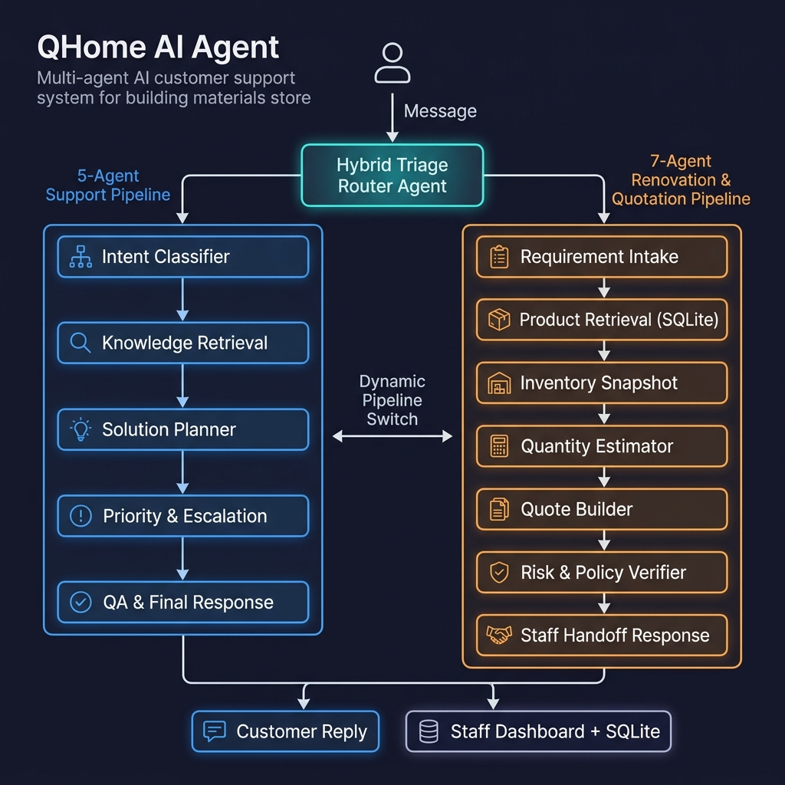
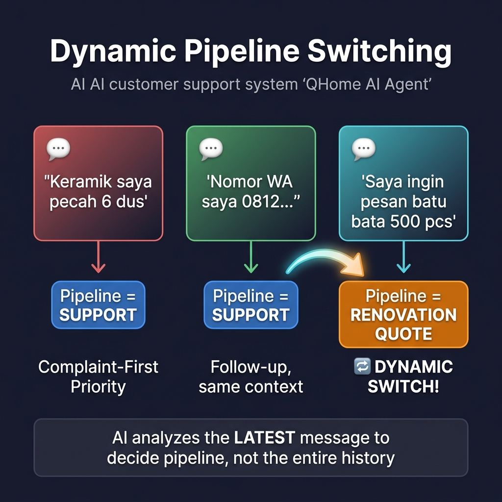
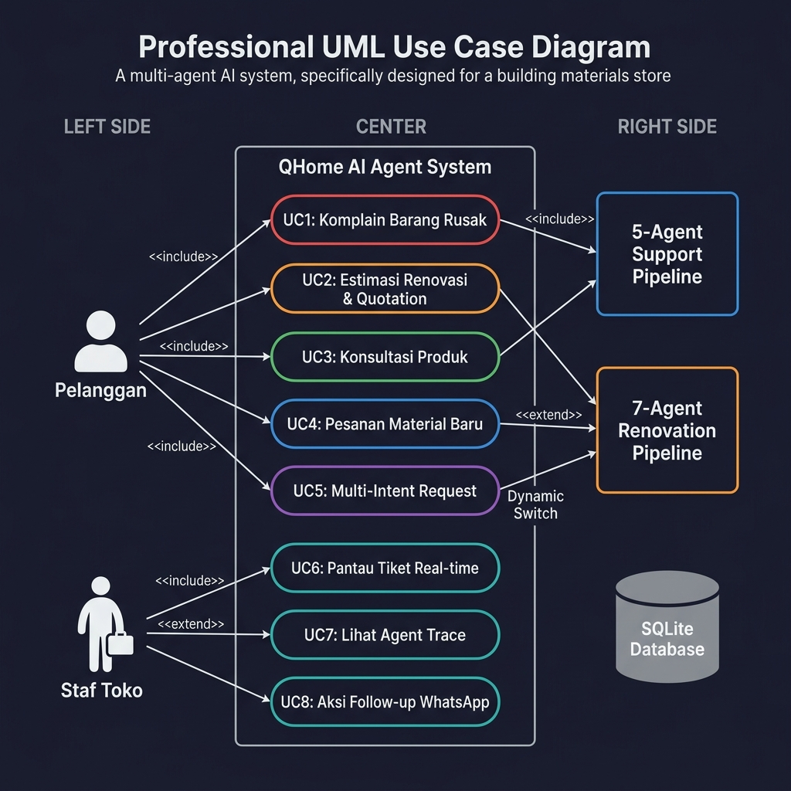

# QHome AI Agent 🏠

> **AI Agent Competition 2026** — Multi-Agent Orchestrator untuk Customer Support & Quotation Otomatis

**QHome AI Agent** adalah sistem **Multi-Agent AI** yang dirancang untuk mengotomatisasi triage customer support, konsultasi produk, kalkulasi material bangunan, dan pembuatan draf penawaran (quotation) secara end-to-end — untuk bisnis retail material bangunan **QHome Mart Yogyakarta**.

[](https://python.org)
[](https://sqlite.org)
[](#-pengujian--evaluasi)
[](#-pengujian--evaluasi)

---

## 📐 Arsitektur Sistem

Setiap pesan pelanggan melewati **Hybrid Triage Router Agent** (LLM-powered) sebelum diarahkan ke salah satu dari dua pipeline agen secara dinamis.



**Komponen utama:**
- **Triage Router Agent** — Gerbang cerdas berbasis LLM yang menganalisis intent pelanggan dan memutuskan pipeline terbaik.
- **5-Agent Support Pipeline** — Untuk komplain, retur, pertanyaan kebijakan, dan eskalasi risiko.
- **7-Agent Renovation & Quotation Pipeline** — Untuk estimasi biaya, kalkulasi material, dan pembuatan draf penawaran otomatis.
- **SQLite Database** — Penyimpanan persisten untuk tiket, produk, inventori, quotation, dan riwayat agen.
- **Staff Dashboard** — Antarmuka real-time untuk memantau progres agen dan menindaklanjuti tiket.

---

## 🔄 Dynamic Pipeline Switching

Fitur unggulan sistem ini: AI secara otomatis berpindah pipeline berdasarkan **pesan terbaru** pelanggan, tanpa perlu intervensi staf.



**Aturan Bisnis:**

| Skenario | Perilaku Sistem |
|----------|----------------|
| Komplain + pesanan di **1 pesan yang sama** | Prioritaskan komplain → Pipeline `support`. Pesanan dicatat sebagai `secondary_intents`. |
| Komplain di pesan lama, **pesan baru = pesanan** | Otomatis **switch** ke pipeline `renovation_quote` (7-agent). |
| Follow-up (kasih nomor WA, dll.) | Tetap di pipeline sebelumnya, tidak mengulang jawaban lama (anti-looping). |

---

## 💬 Use Case



---

## 🗂️ Pipeline Detail

### Pipeline 1: Support (5-Agent)

Diaktifkan untuk komplain, retur, pertanyaan kebijakan, dan eskalasi risiko.

| # | Agen | Fungsi |
|---|------|--------|
| 1 | **Intent Classifier** | Klasifikasi intent berdasarkan pesan terbaru pelanggan |
| 2 | **Knowledge Retrieval** | Cari FAQ, kebijakan retur, dan panduan produk dari knowledge base |
| 3 | **Solution Planner** | Buat rencana resolusi + outline respons pelanggan |
| 4 | **Priority & Escalation** | Tentukan level prioritas, SLA, dan tim eskalasi |
| 5 | **QA & Final Response** | Cek konsistensi antar-agen, hasilkan respons final kontekstual |

### Pipeline 2: Renovation & Quotation (7-Agent)

Diaktifkan untuk permintaan kalkulasi material, estimasi biaya, dan pesanan baru.

| # | Agen | Fungsi |
|---|------|--------|
| 1 | **Requirement Intake** | Ekstrak tipe proyek, luas area (m²), budget, item yang dibutuhkan |
| 2 | **Product Retrieval** | Query SKU produk relevan dari database SQLite |
| 3 | **Inventory Snapshot** | Cek stok cabang + peringatan stok rendah |
| 4 | **Quantity Estimator** | Kalkulasi deterministik: tile formula, paint formula, waste +10% |
| 5 | **Quote Builder** | Generate ID unik `QTE-XXXX`, hitung subtotal, simpan ke DB |
| 6 | **Risk & Policy Verifier** | Validasi kelengkapan data, cek inkonsistensi, loop revisi |
| 7 | **Staff Handoff Response** | Susun respons + instruksi handoff lengkap untuk staf toko |

---

## 🛠️ Cara Menjalankan

> **Zero heavy dependencies.** Hanya Python 3.11+ dan SQLite bawaan.

### 1. Inisialisasi Database
```bash
python3 run.py init-db
```

### 2. Jalankan Web Demo
```bash
python3 run.py web
```

| URL | Halaman |
|-----|---------|
| `http://127.0.0.1:8000/` | Customer Chat UI |
| `http://127.0.0.1:8000/staff` | Staff Dashboard (Live Agent Trace) |

### 3. Jalankan via CLI
```bash
python3 run.py list-tickets
python3 run.py run --mode mock --ticket-id eval-bathroom-2x2
```

Output tersimpan di `runs/<run-id>/` (`interactions.jsonl`, `final_output.json`, `report.md`).

---

## 🔑 Live Mode (Real LLM API)

Buat file `.env` di root project:
```ini
AI_API_KEY=your_api_key_here
AI_BASE_URL=https://ai.sumopod.com/v1
AI_MODEL=gpt-4o-mini
```

```bash
# Via CLI
python3 run.py run --mode live --ticket-id eval-bathroom-2x2

# Eval dengan real API
python3 run.py eval --mode live
```

---

## 🧪 Pengujian & Evaluasi

### Unit & Integration Test Suite — 56 Tests
```bash
python3 -m unittest discover -s tests -v
```
Mencakup: routing triage, multi-intent, dynamic pipeline switching, kalkulator deterministik, persistensi SQLite, normalisasi output, edge case, dan adversarial test. **Result: 56/56 OK ✅**

### Eval Suite (100-Point Rubric) — 5 Golden Scenarios
```bash
python3 run.py eval
```

Penilaian berdasarkan akurasi routing (30), safety & compliance seperti absennya link WA (40), dan kualitas data packet/quotation (30).

| Skenario | Fokus | Score |
|----------|-------|-------|
| `golden_1` | Keluhan keramik pecah | 100/100 |
| `golden_2` | Estimasi pagar bata | 100/100 |
| `golden_3` | Komplain lalu tanya cat | 95/100 |
| `golden_4` | Cek harga semen massal | 100/100 |
| `golden_5` | Tanya kode script | 100/100 |
| **Rata-rata** | | **99/100 — 5/5 PASSED** |

### Quality & Smoke Scripts
Tersedia skrip check end-to-end yang mengotomasi seluruh pipeline evaluasi:
- Linux/macOS: `scripts/smoke_linux.sh`
- Windows CMD: `scripts/smoke_windows.bat`
- Windows PowerShell: `scripts/smoke_windows.ps1`

---

## 📁 Struktur Project

```text
qhome-ai-agent/
├── run.py                          Entry point (CLI + web server)
├── scripts/                        Skrip otomasi smoke test & eval
│   ├── run_full_quality_check.py   Eksekusi unittest & eval 100 poin
│   ├── smoke_linux.sh              Shell script untuk Linux/macOS
│   ├── smoke_windows.bat           Batch script untuk Windows
│   └── smoke_windows.ps1           PowerShell script untuk Windows
├── data/
│   ├── qhome_agent.db              SQLite database operasional
│   ├── evaluation_cases.json       7 skenario evaluasi otomatis
│   ├── knowledge_base.json         FAQ & panduan produk
│   ├── sample_tickets.json         Tiket demo pelanggan
│   └── seed/                       Data awal (products, inventory, policies)
├── docs/
│   ├── system_architecture.png     Diagram arsitektur sistem
│   ├── pipeline_switching.png      Diagram dynamic pipeline switching
│   ├── use_case_diagram.png        Diagram use case
│   ├── architecture.md             Arsitektur teknis (teks)
│   ├── judging.md                  Kesesuaian kriteria penilaian juri
│   ├── database.md                 Skema database SQLite
│   └── demo_scenarios.md           Skenario demo video
├── src/qhome_ai_agent/
│   ├── agents.py                   System prompt semua agen (1+5+7)
│   ├── orchestrator.py             Workflow & dynamic pipeline switching
│   ├── models.py                   Data classes (RunState, AgentStep)
│   ├── storage.py                  Repositori data SQLite
│   ├── tools.py                    Kalkulator deterministik (tile, paint)
│   ├── mock_llm.py                 Simulasi agen untuk testing/CI
│   ├── llm.py                      Client API SumoPod/OpenAI-compatible
│   └── web.py                      Web server (stdlib only)
├── web/
│   ├── customer.html / .js         Customer Chat UI
│   ├── staff.html / .js            Staff Dashboard (live agent trace)
│   └── styles.css                  Shared styling
└── tests/
    ├── golden/                      Golden dataset untuk regresi
    │   └── scenarios.json
    ├── test_alias_resolver.py       Test logika resolusi alias
    ├── test_calculator_tools.py     Test formulasi alat hitung (cat/keramik)
    ├── test_integration_scenarios.py Test e2e pipeline support & renovasi
    ├── test_mock_workflow.py        Test engine & prioritas intent
    ├── test_product_retrieval.py    Test query produk ke database
    ├── test_renovation_pipeline.py  Test 7-agent sequential workflow
    ├── test_support_case_packet.py  Test instruksi & penanganan staf
    └── test_triage_normalization.py Test guardrails & normalisasi intent
```

---

## 🏆 Keunggulan Teknis

| Kriteria Kompetisi | Implementasi |
|-------------------|-------------|
| **Multi-Agent Architecture** | 1 Router + 5 Support + 7 Renovation = 13 agen total |
| **Agent Reasoning** | Setiap agen menghasilkan `reasoning` dalam Bahasa Indonesia |
| **Context Awareness** | Latest-message-first routing + anti-looping |
| **Business Rules** | Complaint-First, Tone Protection, Dynamic Switch |
| **Persistent State** | SQLite: tickets, quotes, inventory, agent_runs |
| **Deterministic Tools** | Formula tile (waste+10%), paint (liter/m²) |
| **Observability** | Live agent trace di Staff Dashboard per langkah |
| **Reproducibility** | Mock mode + eval suite + 20 unit tests |
| **Zero Dependencies** | Python stdlib + SQLite saja |
