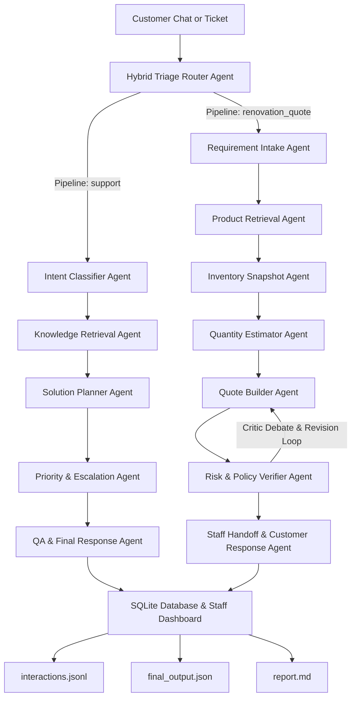

# Architecture & Orchestration System

QHome AI Agent menggunakan arsitektur **Hybrid Orchestration & Multi-Agent System** berbasis SQLite dan LLM. Sistem ini dirancang secara dinamis menggunakan **Triage Router Agent** di gerbang pertama untuk mendeteksi intent, membagi rute secara cerdas, dan menangani multi-intent secara elegan.

Sistem mendukung dua jalur pipeline utama:
1. **5-Agent Legacy Support Pipeline**: Untuk penanganan komplain, after-sales, pelacakan pengiriman, dan layanan pelanggan standar.
2. **7-Agent Renovation & Quotation Pipeline**: Untuk konsultasi desain, kalkulasi material otomatis, pengecekan inventori, pembuatan draf penawaran harga (quotation), dan audit kebijakan.

---

## 1. Alur Kerja Orchestrator (Workflow)



---

## 2. Layer Triage & Orchestration (AI-Powered Multi-Intent Router)

Alih-alih menggunakan aturan berbasis kata kunci (*rule-based text matching*), gerbang utama QHome AI sekarang menggunakan **Triage Router Agent** formal berbasis LLM. Agent ini secara cerdas menghasilkan output JSON terstruktur untuk mengevaluasi maksud pelanggan.

### Parameter Output Triage Router
```json
{
  "primary_intent": "damaged_item",
  "secondary_intents": ["renovation_quote"],
  "selected_pipeline": "support",
  "multi_intent": true,
  "routing_reason": "Pelanggan mengeluhkan barang pecah sekaligus meminta estimasi renovasi...",
  "priority_rule": "complaint_first",
  "staff_handoff_notes": "PENTING: Tangani klaim keramik pecah terlebih dahulu. Jangan menawarkan sales tambahan secara agresif sebelum komplain selesai."
}
```

### Aturan Bisnis Utama (Business Rules)
*   **Complaint/Safety/High-Risk First**: Jika pelanggan mengajukan keluhan/komplain bersamaan dengan permintaan order/renovasi (*mixed multi-intent*), sistem **wajib memprioritaskan komplain** dan mengarahkan ke pipa `support`.
*   **Secondary Handoff Capture**: Keinginan renovasi/pembelian dicatat sebagai intent sekunder (`secondary_intents`) dan didokumentasikan secara aman di instruksi staf (`staff_handoff_notes`).
*   **Tone Protection**: Sistem melarang nada penjualan (*sales*) yang agresif saat pelanggan sedang mengeluhkan barang rusak demi menjaga kepuasan pelanggan.

---

## 3. Shared State & SQLite Repository

Semua agen berkomunikasi melalui shared `RunState` yang merekam setiap langkah pengerjaan secara terurut. Selain file JSON, seluruh daur hidup transaksi dan jalannya agen dicatat di database relasional SQLite (`data/qhome_agent.db`), yang mencakup:
*   `agent_runs`: Melacak nama agen, payload input, output JSON, dan waktu eksekusi.
*   `tickets`: Menyimpan data tiket aktif, nomor WhatsApp, status keluhan, dan info yang masih kurang.
*   `quotes` & `quote_items`: Menyimpan draf penawaran material, total biaya, status anggaran, dan rincian produk terpilih.
*   `products` & `inventory`: Menyimpan katalog material bangunan dan snapshot stok fisik.

---

## 4. Peran Masing-Masing Agen (Agent Responsibilities)

### Jalur 1: Legacy Support Pipeline (5 Agents)
1.  **Intent Classifier Agent**: Mengklasifikasikan tiket dan mendeteksi data yang kurang.
2.  **Knowledge Retrieval Agent**: Mencari kebijakan pendukung (misal kebijakan retur 7 hari) dari basis pengetahuan.
3.  **Solution Planner Agent**: Merancang draf solusi penyelesaian masalah.
4.  **Priority & Escalation Agent**: Menilai prioritas, risiko bisnis, dan SLA eskalasi manusia.
5.  **QA & Final Response Agent**: Menyusun respons empatik final dan langkah staf internal.

### Jalur 2: Renovation & Quotation Pipeline (7 Agents)
1.  **Requirement Intake Agent**: Mengekstrak ukuran area, lokasi, anggaran, dan kategori proyek.
2.  **Product Retrieval Agent**: Memilih SKU material asli yang cocok dari katalog produk SQLite.
3.  **Inventory Snapshot Agent**: Memeriksa ketersediaan stok fisik cabang secara real-time.
4.  **Quantity Estimator Agent**: Melakukan estimasi kuantitas material menggunakan kalkulator deterministik (tiling & painting) ditambah waste factor 10%.
5.  **Quote Builder Agent**: Menyusun draf penawaran harga dengan kode unik `QTE-`.
6.  **Risk & Policy Verifier Agent (The Critic)**: Melakukan audit kepatuhan terhadap kebijakan (*POL-STOCK-SNAPSHOT*, *POL-PRICE-ESTIMATE*, *POL-CONTACT-CONSENT*). Melakukan loop revisi aktif bersama Quote Builder jika ditemukan kesalahan klaim stok/harga.
7.  **Staff Handoff & Customer Response Agent**: Menyusun rangkuman tugas staf internal, instruksi WhatsApp, dan respons aman kepada pelanggan.

---

## 5. Daur Hidup Logging & Evaluasi

Setiap eksekusi workflow secara otomatis memproduksi file audit komprehensif:
*   `runs/<run_id>/interactions.jsonl`: Catatan mentah interaksi per-agen.
*   `runs/<run_id>/final_output.json`: Berkas JSON lengkap yang dikonsumsi oleh web dashboard.
*   `runs/<run_id>/report.md`: Laporan markdown format manusia untuk presentasi juri.
*   Evaluasi Kinerja: Diuji otomatis menggunakan `python3 run.py eval` untuk memvalidasi performa akurasi, kepatuhan safety, dan kualitas estimasi.
