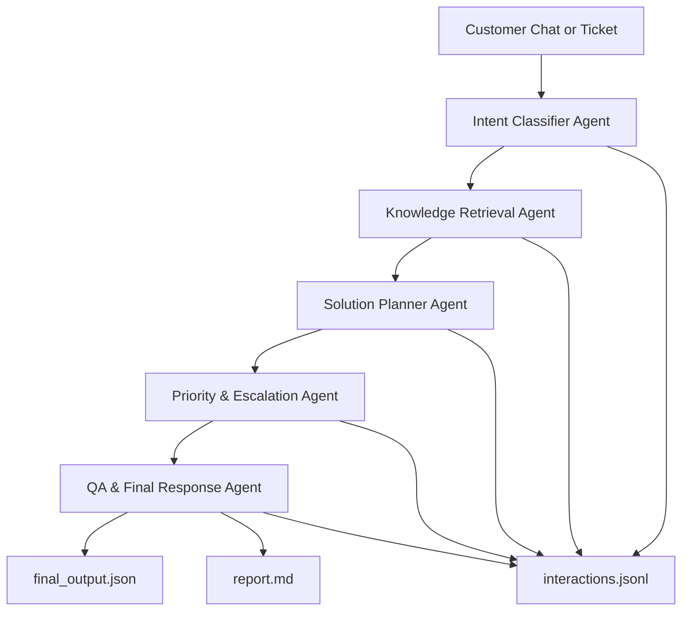

# Architecture

QHome AI Agent memakai arsitektur sequential multi-agent dengan shared state. Pendekatan ini sengaja dipilih agar alur komunikasi agent mudah diaudit, mudah dijelaskan dalam video, dan reproducible untuk juri. Sistem mendukung dua jenis kebutuhan: customer support triage dan product advice.

## Workflow



## Web Demo UX

Web demo memakai dua panel:

- Customer Chat: UI seperti chat CS biasa. Pelanggan dapat mengirim pesan lanjutan.
- Staff Triage Panel: panel internal untuk melihat priority, escalation, missing information, internal next steps, dan agent trace.

Pemisahan ini penting karena customer hanya membutuhkan jawaban natural, sedangkan staff/juri membutuhkan bukti reasoning dan keputusan operasional.

## Shared State

Setiap agent menerima state berisi ticket awal dan output agent sebelumnya. Agent berikutnya tidak bekerja dari nol, tetapi memakai hasil analisis sebelumnya sebagai konteks.

Format state ringkas:

```json
{
  "run_id": "run-xxxx",
  "ticket": {},
  "agent_outputs": {
    "intent_classifier": {},
    "knowledge_retrieval": {}
  }
}
```

## Agent Responsibilities

- Intent Classifier Agent: menentukan intent, kategori, confidence, ringkasan, dan informasi yang belum lengkap. Intent dapat berupa support issue atau product_advice.
- Knowledge Retrieval Agent: memilih policy/FAQ/product guide yang relevan dari `data/knowledge_base.json`.
- Solution Planner Agent: membuat langkah penyelesaian, rekomendasi tipe produk, dan outline respons pelanggan.
- Priority & Escalation Agent: menilai urgency, risiko bisnis, SLA, dan apakah perlu eskalasi manusia.
- QA & Final Response Agent: menyatukan hasil agent, mengecek konsistensi, dan membuat output final.

## Logging

Setiap run menghasilkan:

- `interactions.jsonl`: satu baris JSON per agent, berisi nama agent dan output.
- `final_output.json`: output akhir plus trace lengkap.
- `report.md`: ringkasan manusiawi untuk demo/video.

## API Strategy

Live mode memakai SumoPod AI sebagai OpenAI-compatible API:

```text
POST https://ai.sumopod.com/v1/chat/completions
```

Mock mode tersedia supaya repo tetap bisa dinilai tanpa API key dan tanpa biaya token.

## Data Strategy

Untuk MVP, data dibuat eksplisit di repository agar reproducible:

- Support policies: retur, pengiriman, garansi, instalasi, pembayaran.
- Product guides: dinding lembab/cat, kebocoran kamar mandi, pemilihan keramik, lampu LED.

Database cloud belum menjadi dependency runtime. Jika QHome Mart ingin implementasi production, lapisan knowledge base dapat dipindah dari JSON ke MariaDB/SumoPod database, spreadsheet internal, CMS, atau vector database.
